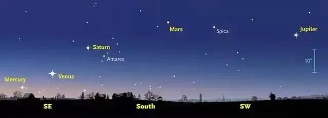
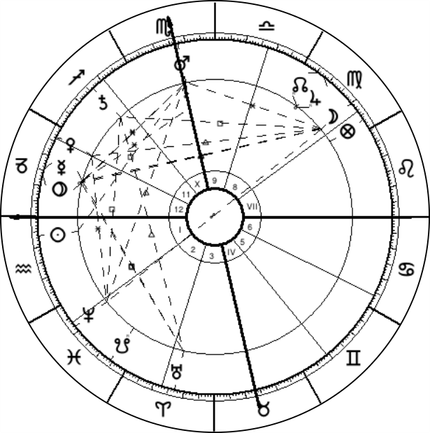
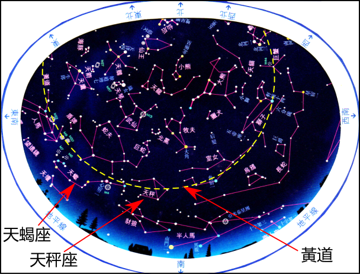

# 渾星圖

## 緣起

即使不是天文發燒友，在亱空看見明亮的星時，總會想知道顆星是什麼名字。或者可以求助於星圖，有某種手錶也是配有星圖的。只要經過校準，就能辨認出星座和相關恒星。

 

 
 
 但如果所看見的是一顆行星，星圖上是不會找到的。因為星圖只能展示恒星。所謂恒星，它們在天空上彼此相對的位置是固定的，所以才能組成星座圖案。
 
 有一種軟件叫占星軟件，你不必對占星術有興趣，都可以使用它來計算出特定時間地點看見的行星位置。如果今晚約了朋友去觀星，除了要帶上星圖外，也不防用占星軟件計算一下晚上能看到那幾顆行星。

有一種天文現象叫「五星連珠」。2016年1月17日太陽出來之前會看到五大行星同時在天空出現。下面是一張網上找到的圖片，其下是占星軟件計算結果和對應日期時間的星圖。

